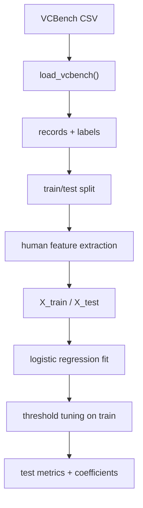

# VCBench Human-Feature Script Architecture

This document describes the architecture of `vcbench_lambda_features_minimal.py`
as used for the human-only baseline.

## Components

1. Data loading
   - Loads VCBench founder records and labels from a CSV.
   - Produces a list of record dicts and a label array.

2. Feature extraction (human only)
   - Extracts 15 hand-engineered binary features from each record.
   - Produces a feature matrix for train and test sets.

3. Train/test split
   - Splits records into train and test before any model training.
   - Uses stratified splitting to preserve class balance.

4. Model training
   - Trains a logistic regression classifier on the human features.
   - Fits on the train feature matrix only.

5. Threshold tuning
   - Sweeps thresholds on the training set to maximize F0.5.
   - Selects the best threshold for test evaluation.

6. Evaluation and reporting
   - Computes ROC-AUC, PR-AUC, precision, recall, F0.5, and accuracy on test.
   - Prints feature coefficients for interpretability.

## Data flow (human-only)

