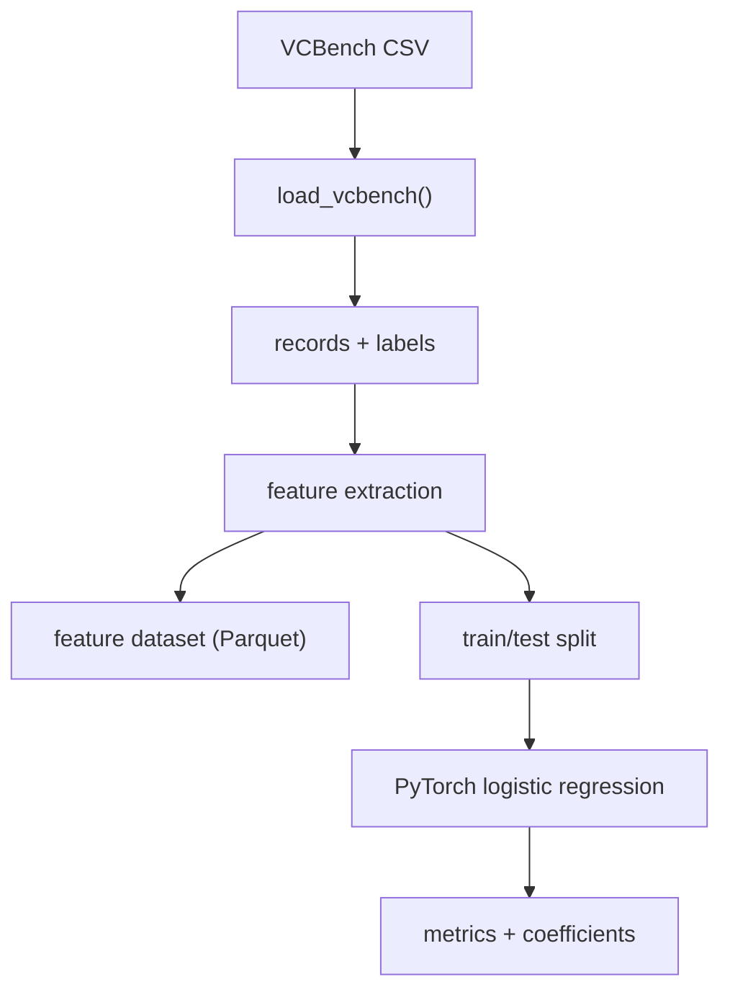

# VCBench Pipeline Architecture

This pipeline implements a modular feature and training flow for VCBench.

## High-level flow
1. **Load data**  
   Read the VCBench CSV (sample or full) and parse into structured records.

2. **Feature extraction**  
   - **Baseline features**: 15 features loaded from the example script.  
   - **Custom features**: registry-defined features (QS tiers, exits, tenure).  
   - **Optional LLM features**: generated by an LLM and evaluated on records.

3. **Feature dataset output**  
   Save a Parquet file with `founder_uuid`, `success`, and all extracted features.

4. **Train/test split**  
   Split records into train/test (default 80/20).

5. **Model training**  
   Train a PyTorch logistic regression model (N inputs → 1 output).

6. **Evaluation & reporting**  
   Report ROC-AUC, PR-AUC, precision@k, F0.5, and coefficients.

## Modes
- **Human**: baseline + custom features  
- **LLM**: LLM features only  
- **Hybrid**: baseline + custom + LLM features

## Data flow diagram

