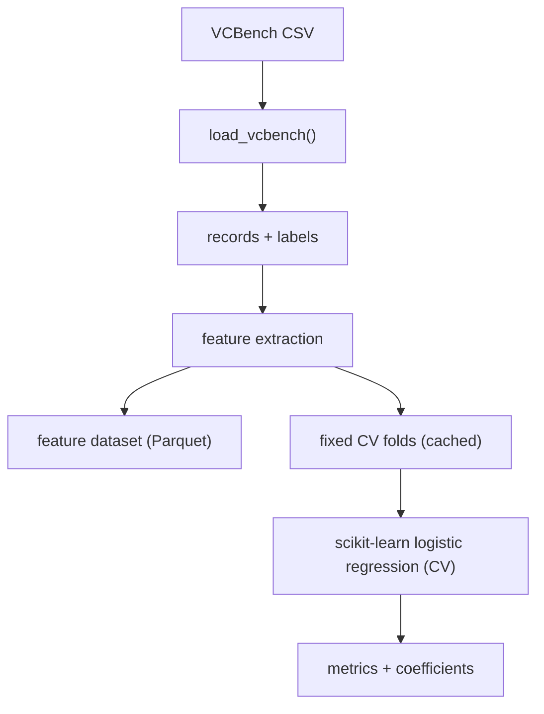

# VCBench Pipeline Architecture

This pipeline implements a modular feature and training flow for VCBench, including LLM-reasoning features.

## High-level flow (plain text)
1. **Load data**  
   Read the VCBench CSV (sample or full) and parse into structured records.

2. **Feature extraction**  
   - **Baseline features**: 15 features loaded from the example script.  
   - **Custom features**: registry-defined features (QS tiers, exits, durations).  
   - **LLM-engineered features**: rules generated from a fixed seed_100, applied to the pool.  
   - **LLM-reasoning features**: per-founder prompt outputs from core + experiments (batched within folds).

3. **Feature dataset output**  
   Save Parquet with `founder_uuid`, `success`, and extracted features.

4. **Fixed CV folds**  
   Use a fixed stratified K-fold split (default 10) stored on disk for repeatability.

5. **Model training**  
   Train a scikit-learn Logistic Regression model (N inputs -> 1 output) evaluated via CV.

6. **Evaluation & reporting**  
   Report ROC-AUC, PR-AUC, precision@k, F0.5, and coefficients.

## Modes
- **Human**: baseline + custom features  
- **LLM**: LLM-engineered features only  
- **Reasoning**: LLM-reasoning features only  
- **Hybrid**: baseline + custom + LLM-engineered + LLM-reasoning  

## Data flow diagram

For more detailed diagrams, see:
- [architecture_overview.md](C:\Users\joelb\OneDrive\Vela_partnerships_project\Project_folder\5_llm_reasoning\docs\architecture_overview.md)
- [data_flow.md](C:\Users\joelb\OneDrive\Vela_partnerships_project\Project_folder\5_llm_reasoning\docs\data_flow.md)
