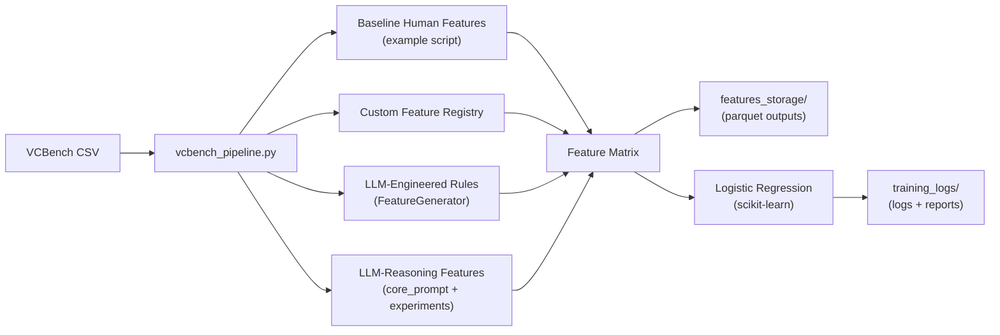

# Architecture Overview

## Plain-Text Summary
The pipeline is a single entry point (`vcbench_pipeline.py`) that can build features from three sources: baseline human features (from the example script), custom registry features (local), and LLM-derived features (engineered rules or LLM-reasoning outputs). It then trains and evaluates a logistic regression model. Feature datasets and logs are organized by mode in `features_storage/` and `training_logs/`.

## Architecture Diagram (Mermaid)

## Key Modules
- `vcbench_pipeline.py`: Orchestrates data loading, feature extraction, saving, training, and metrics.
- `feature_registry.py`: Defines custom human features and feature sets.
- `llm_feature_generation.py`: Generates LLM-engineered rules (train-only).
- `llm_reasoning_features.py`: Generates reasoning features using prompts/experiments.
- `feature_selector_gui.py`: Creates/loads `features.json`.
