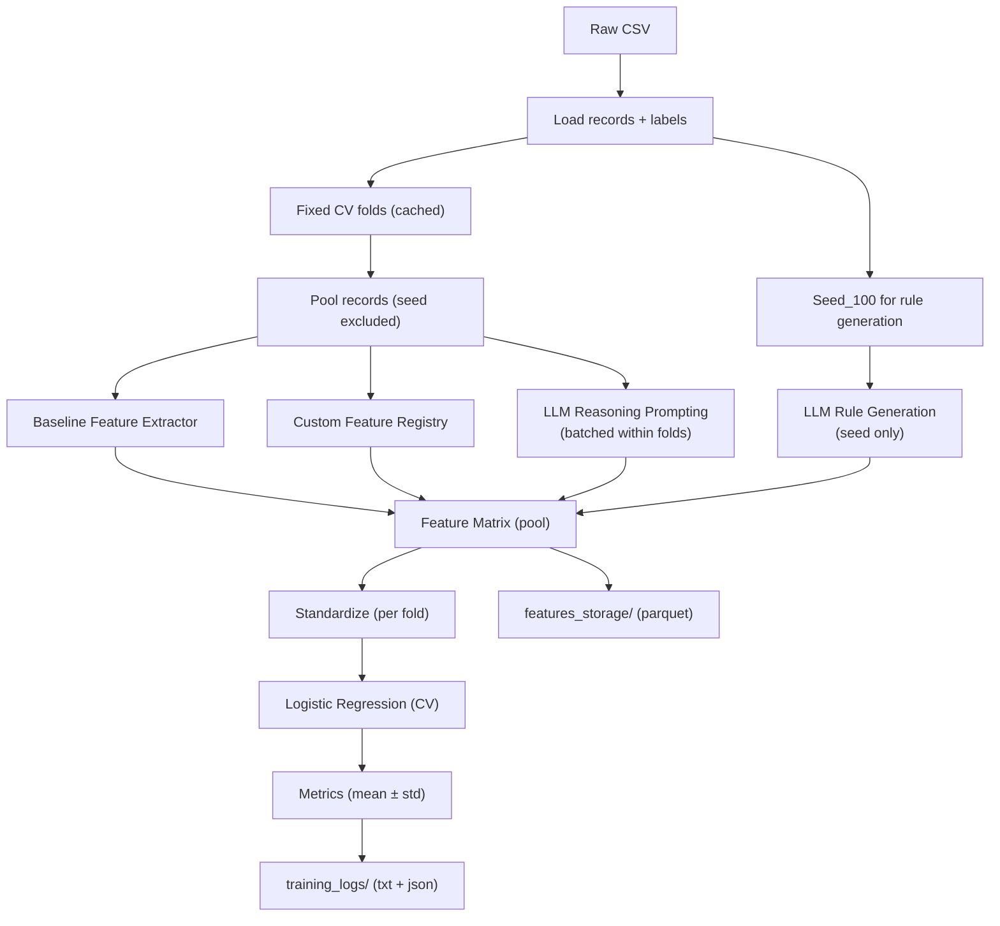

# Data Flow (Plain Text + Diagram)

## Plain-Text Flow
1. **Load dataset** (`vcbench_final_public.csv` or sample).
2. **Create or load fixed CV folds** (by founder_uuid).
3. **Select seed_100** for LLM-engineered rule generation and exclude from training.
4. **Extract features**:
   - Baseline human features from the example script.
   - Custom features from the registry.
   - LLM-engineered rules (seed-only generation, applied to pool).
   - LLM-reasoning features (per-founder prompt outputs, batched within folds).
5. **Assemble feature matrix** for the selected mode.
6. **Standardize continuous features** within each CV fold.
7. **Save feature datasets** to `features_storage/`.
8. **Train logistic regression** with stratified K-fold CV.
9. **Evaluate metrics** as mean ± std across folds.
10. **Write logs and run reports** to `training_logs/`.

## Data Flow Diagram (Mermaid)

