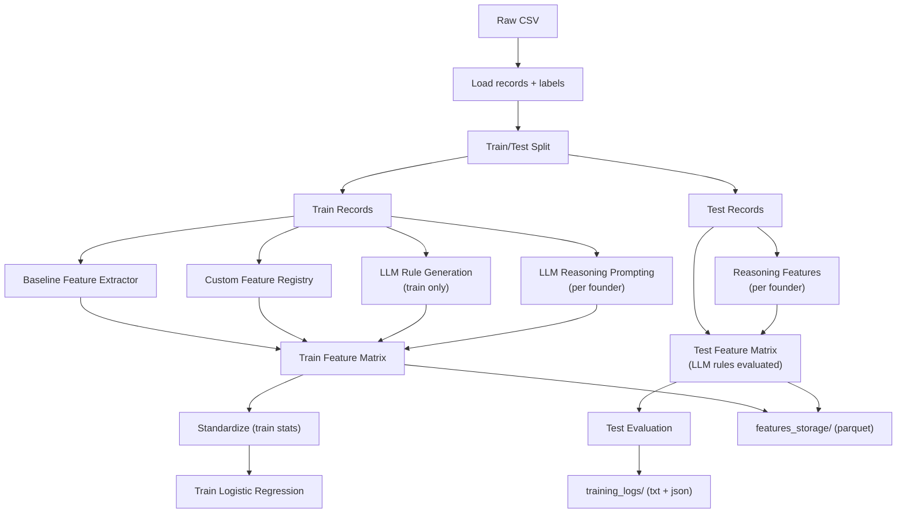

# Data Flow (Plain Text + Diagram)

## Plain-Text Flow
1. **Load dataset** (`vcbench_final_public.csv` or sample).
2. **Split train/test** once with a fixed random seed.
3. **Extract features**:
   - Baseline human features from the example script.
   - Custom features from the registry.
   - LLM-engineered rules (train-only generation, evaluated on all).
   - LLM-reasoning features (per-founder prompt outputs).
4. **Assemble feature matrix** for the selected mode.
5. **Standardize continuous features** (train stats only).
6. **Save feature datasets** to `features_storage/`.
7. **Train logistic regression** and tune threshold on training set.
8. **Evaluate metrics** on test set.
9. **Write logs and run reports** to `training_logs/`.

## Data Flow Diagram (Mermaid)

