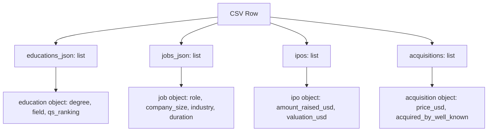

# Data Structure Diagram

```mermaid
graph TD
  A["CSV Row"] --> B["educations_json: list"]
  A --> C["jobs_json: list"]
  A --> D["ipos: list"]
  A --> E["acquisitions: list"]
  B --> B1["education object: degree, field, qs_ranking"]
  C --> C1["job object: role, company_size, industry, duration"]
  D --> D1["ipo object: amount_raised_usd, valuation_usd"]
  E --> E1["acquisition object: price_usd, acquired_by_well_known"]
```
