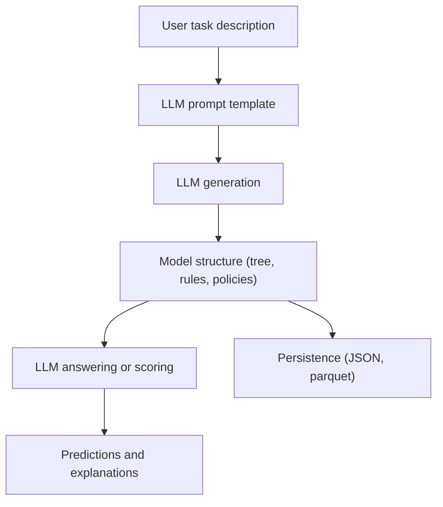

# Think Reason Learn Architecture

This document summarizes the architecture of Think Reason Learn (TRL) based on
the local repository contents.

## High level idea
TRL is a Python library that combines interpretable ML structures with LLM
reasoning. Classical model structure is preserved, but key steps like feature
generation and question answering are delegated to LLMs using a unified
provider interface.

## Core package layout

- `think_reason_learn.core`
  - Shared utilities, config, exceptions, and the LLM abstraction.
- `think_reason_learn.core.llms`
  - A singleton `LLM` router with provider-specific clients for OpenAI,
    Google, Anthropic, and xAI. Supports async and sync calls, retries via
    fallback order, and token usage tracking.
- `think_reason_learn.gptree`
  - LLM-guided decision tree classifier (GPTree).
- `think_reason_learn.rrf`
  - Random Rule Forest (RRF) for binary classification using LLM-generated
    YES/NO questions.
- `think_reason_learn.policy_induction`
  - Policy induction ensemble that generates policies with LLMs and learns
    linear weights with logistic regression.
- `think_reason_learn.features`
  - LLM rule generation for binary features plus a safe evaluator for lambda
    rules.

## LLM orchestration layer

Key points from `think_reason_learn.core.llms`:

- `LLM` is a singleton router that validates a priority list of provider models.
- Providers are initialized from API keys in `.env` or environment variables.
- Both async and sync interfaces exist (`respond` and `respond_sync`).
- Responses are structured via Pydantic models when needed.
- Token usage is tracked through `TokenCounter` and `TokenCount`.

## GPTree pipeline (LLM-guided decision trees)

GPTree is an async, resumable decision tree builder with LLM-based question
generation and answering.

1. Task setup
   - `set_task` generates a question generation template using the LLM.
2. Fit loop
   - Each node produces candidate questions via LLM.
   - A critic model can refine or rank questions.
   - The best question is chosen by a standard criterion (gini).
3. LLM-driven answering
   - Each candidate question is answered by the LLM to produce split labels.
4. Tree growth
   - Tree expands until max depth or purity rules.
5. Persistence
   - `save` writes a JSON manifest and (optionally) training data parquet.
   - `load` reconstructs the tree, including nodes and frontier state.

## RRF pipeline (Random Rule Forest)

RRF builds an ensemble of LLM-generated YES/NO rules and scores them by
predictive quality.

1. Task setup
   - `set_tasks` produces a question generation template or uses a prompt preset.
2. Question generation
   - LLM proposes many candidate YES/NO questions.
3. Semantic filtering (optional)
   - Early deduplication can remove near-duplicate questions.
4. Question answering
   - LLM answers each question for each sample (supports batch mode).
5. Scoring and selection
   - Questions are scored (precision, recall, F1/F-beta).
6. Aggregation
   - Prediction aggregates top K questions with a threshold T.
7. Persistence
   - `save` writes a JSON manifest and parquet artifacts.

## Policy Induction pipeline

Policy Induction produces a weighted set of human-readable policies.

1. Task setup
   - `set_task` creates a policy generation template via LLM.
2. Policy generation
   - LLM generates a bounded set of policies from sampled data.
3. Policy scoring
   - LLM predicts policy outcomes on data.
4. Weight optimization
   - Logistic regression finds optimal weights and threshold.
5. Persistence
   - Saves a manifest, policies, predictions, and trained LR model.

## Feature generation and safe evaluation

The `features` module generates binary classification rules as lambda strings
and evaluates them deterministically:

- `FeatureGenerator` uses the LLM to generate rule expressions.
- `FeatureEvaluator` compiles rules with a restricted set of builtins and
  optional helper functions, then evaluates records to produce a feature
  matrix.

## Concurrency model

All major algorithms use async flows and semaphores to control LLM concurrency.
This avoids overwhelming providers and makes batching possible.

## Data and artifact persistence

Models store:
- JSON manifest of parameters and state
- Parquet files for training data and derived artifacts
- Optional stripping of training data for production builds

## Simplified data flow diagram

